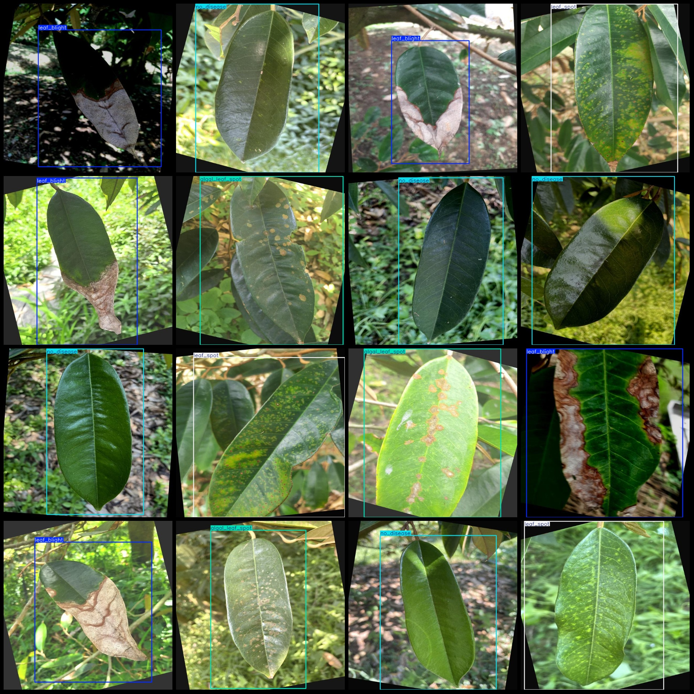
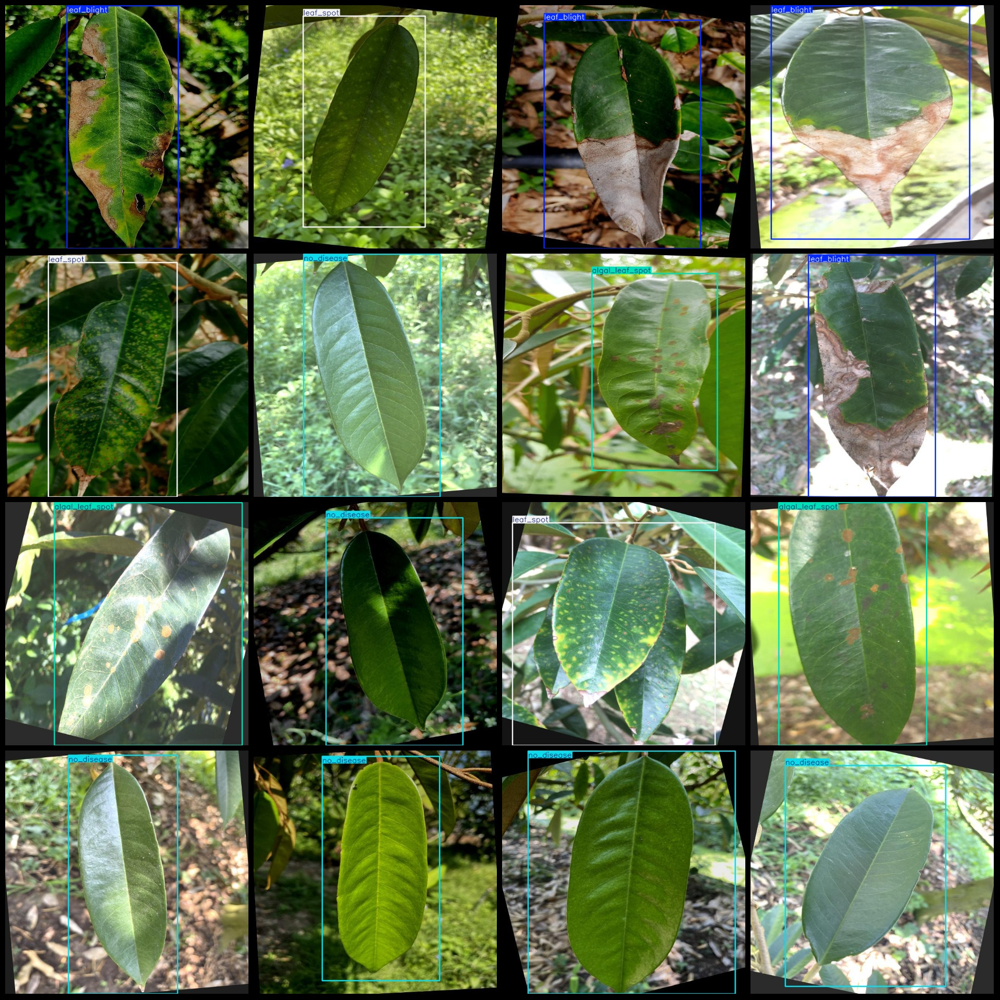

# Dataset for Detecting Diseases in Durian Leaves in VOC+YOLO Format with 4 Categories and Enhanced Features

Dataset contains a large number of rotated augmented images, more than half of the images are enhanced.
Dataset format: Pascal VOC format + YOLO format (txt file without split path, only contain jpg images and corresponding VOC format xml files and YOLO format txt files).
Number of images (number of jpg files): 420
Number of annotations (number of xml files): 420
Number of annotations (number of txt files): 420
Number of annotation categories: 4
Annotation category names (note that the order of classes in YOLO format is not consistent with this, but according to the "labels" folder's "classes.txt"): ["algal_leaf_spot", "leaf_blight", "leaf_spot", "no_disease"]
Number of bounding boxes per category:
Algal_leaf_spot (algae spot disease) bounding box count = 105
Leaf_blight (leaf blight) bounding box count = 107
Leaf_spot (leaf spot) bounding box count = 108
No_disease (no disease) bounding box count = 107
Total bounding box count: 427
Number of images per category:
Algal_leaf_spot (algae spot disease) images per category = 105
The number of leaf blight images = 105
Leaf spot (leaf spot) has 105 pictures.
No disease (no disease) has 107 pictures.
Image resolution: 640x640
Use annotation tool: labelImg
Rules for annotation: draw rectangle around categories
Important Note: The dataset does not have a split into training, validation, and test sets.
Special Notice: This dataset does not guarantee the accuracy of the trained model or weight files.
Preview of the image:
## Images

Here is a pay link on Stripe ( https://buy.stripe.com/3cs8yP7sY87d0vu9AB ). Please contact me lonlonago@foxmail.com after funding $89, and I will send you a complete data files , thank you!

